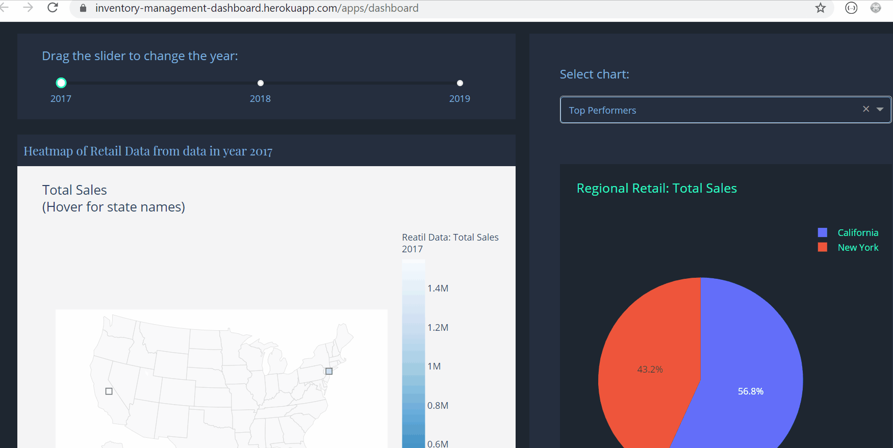
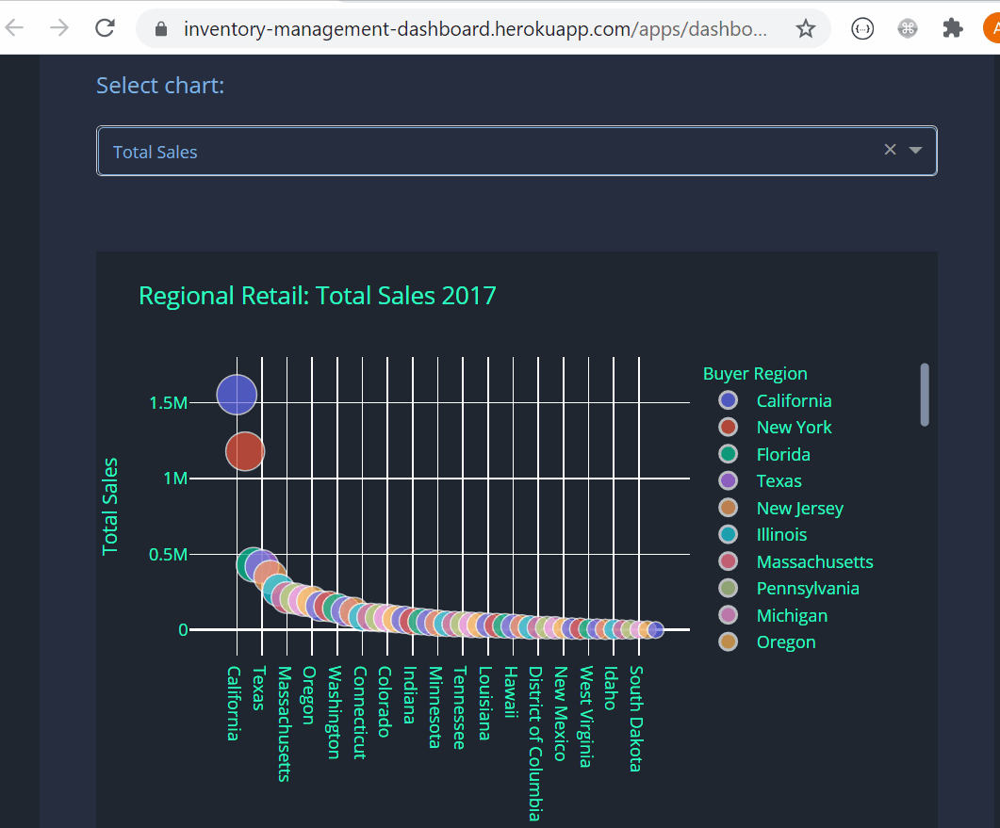
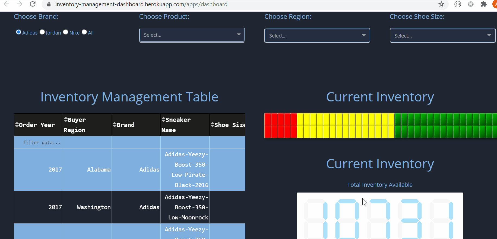

# Analytics Dashboard | Plotly Dash Application 

#### Check out the live site:
<https://inventory-management-dashboard.herokuapp.com/apps/dashboard>
## Background

The purpose of this project is to build an Analytics Dashboard that will allow a business to have greater sales and inventory visability.

## Overview

This completely interactive Analytics Dashboard was built using Python's Plotly Dash.

## Application Features

### Sales and Inventory Analytics over time

Toggle the time slicer and watch the charts respond.

### Sales Performance KPIs

Deep dive into the sales performance.

### Search for Inventory

Drill down into current inventory and inventory performance by Brand, Product, Region and Size !

